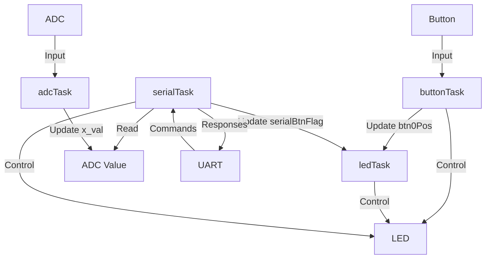

# Proyek Kontrol LED dan ADC dengan STM32 dan FreeRTOS

## Tentang Proyek

Proyek ini menggunakan mikrokontroler STM32 dengan sistem operasi real-time FreeRTOS untuk mengimplementasikan kontrol LED, pembacaan tombol, komunikasi serial, dan konversi analog-ke-digital (ADC). Proyek ini mendemonstrasikan penggunaan multi-tasking dalam sistem embedded.

## Penjelasan Task

Proyek ini terdiri dari lima task utama:

1. **defaultTask**: 
   - Ini adalah task default yang dibuat oleh STM32CubeMX.
   - Tidak melakukan fungsi khusus dalam proyek ini.

2. **buttonTask**:
   - Membaca status tombol (BTN0).
   - Mengontrol LED berdasarkan status tombol.
   - Memperbarui variabel global `btn0Pos`.

3. **ledTask**:
   - Mengendalikan LED berdasarkan status tombol dan flag serial.
   - Berkedip ketika tombol tidak ditekan atau flag serial aktif.

4. **serialTask**:
   - Menangani komunikasi serial.
   - Menerima perintah untuk mengontrol LED dan membaca nilai ADC.
   - Memperbarui `serialBtnFlag` berdasarkan perintah yang diterima.

5. **adcTask**:
   - Melakukan konversi analog-ke-digital.
   - Memperbarui variabel global `x_val` dengan nilai ADC terbaru.

## Interaksi Antar Task

- **buttonTask** dan **ledTask** berinteraksi melalui variabel `btn0Pos`. **buttonTask** memperbarui nilai ini, sementara **ledTask** membacanya untuk menentukan perilaku LED.

- **serialTask** berinteraksi dengan **ledTask** melalui `serialBtnFlag`. **serialTask** dapat mengubah perilaku LED melalui perintah serial.

- **adcTask** memperbarui `x_val`, yang kemudian dapat dibaca oleh **serialTask** untuk mengirimkan nilai ADC melalui serial jika diminta.

- Semua task berbagi sumber daya hardware yang sama (LED, tombol, ADC, UART) namun dikelola oleh FreeRTOS untuk menghindari konflik.

## Diagram Alur Kerja

Berikut adalah diagram yang mengilustrasikan alur kerja dan interaksi antar task:

## Penggunaan

Untuk menggunakan proyek ini:

1. Pastikan Anda memiliki STM32CubeIDE terinstal.
2. Clone repositori ini.
3. Buka proyek di STM32CubeIDE.
4. Build dan flash program ke board STM32 Anda.

## Perintah Serial

Proyek ini mendukung beberapa perintah serial:

- '0': Menyalakan LED
- '1': Mematikan LED
- '2': Membaca dan mengirimkan nilai ADC
